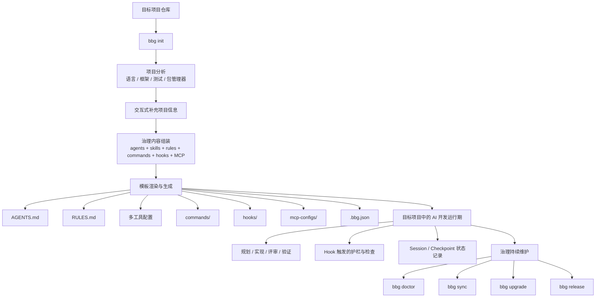
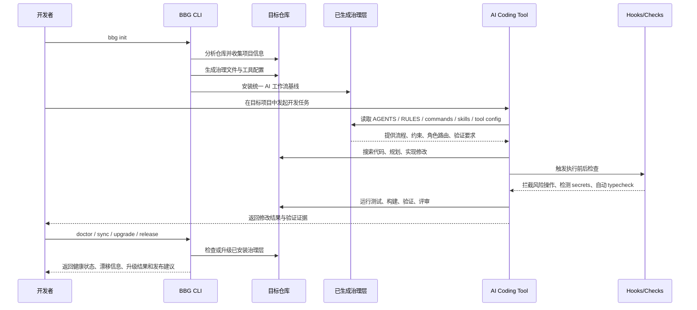

# BBG Harness Engineering 产品方案

**创建时间**: 2026-04-02
**状态**: Draft
**适用对象**: 产品、工程、AI 治理负责人
**文档目标**: 明确 BBG 作为目标项目 AI 开发 Harness 接入产品的定位、能力边界、价值、缺口与演进路线

---

## 一、摘要

BBG 是一个面向目标项目的 AI 开发工作流治理型 CLI。它通过分析目标仓库的语言、框架、测试体系和工程结构，自动生成一套可落地的 AI 开发 Harness，包括 `AGENTS.md`、`RULES.md`、多工具配置、工作流命令、自动化 hooks、MCP 配置和上下文文件，使 Claude Code、OpenCode、Cursor、Codex CLI、GitHub Copilot、Kiro 等工具在同一代码库中遵循一致的工程规范和协作流程。

BBG 解决的核心问题不是“让 AI 能写代码”，而是“让 AI 在团队工程体系里以可控、可复用、可验证、可升级的方式写代码”。在没有 Harness 的情况下，AI 使用高度依赖个人 prompt、个人习惯和工具私有配置，结果是行为漂移、质量不稳定、难以审计、难以升级。BBG 通过生成统一治理层，将这些分散的能力沉淀为项目级资产。

从产品阶段判断，BBG 当前已经具备明显的 Harness Engineering 骨架能力，但整体仍更接近 **Harness-as-Scaffold**，尚未完全演进到 **Harness-as-Platform**。下一阶段重点不应只是继续扩展模板数量，而是补齐执行一致性、观测评估、策略执行和组织级治理能力。

---

## 二、背景与问题定义

### 2.1 当前团队在 AI 开发中的典型问题

当团队自然引入多个 AI 编码工具时，通常会出现以下问题：

- 同一仓库里，不同 AI 工具遵循不同规则和流程
- 高质量输出依赖个人 prompt 能力，而不是项目标准
- 测试、评审、安全、验证要求是隐性的，无法稳定执行
- 本地定制配置逐步漂移，后续升级成本高
- 团队很难回答“AI 工作流到底有没有越来越好”
- 规则和执行脱节，很多要求停留在文档层

### 2.2 产品机会

目标项目需要一套可以快速安装的 AI 开发 Harness，用来完成以下事情：

- 提供 AI 行为的统一事实来源
- 将同一套治理意图投射到多个 AI 工具中
- 在执行路径上增加护栏和验证闭环
- 让治理配置可以持续维护和升级
- 为后续的度量、评估和优化提供基础

---

## 三、产品定位

### 3.1 一句话定位

BBG 是一个为目标项目快速接入 AI 开发 Harness 的治理型 CLI。

### 3.2 产品定义

BBG 本质上是一个：

- 目标项目 AI Harness 安装器
- 治理内容生成器
- 多工具配置适配层
- 工作流标准化分发器
- AI 开发治理的持续维护工具

### 3.3 不是什么

BBG 目前不是：

- 大模型推理平台
- 目标项目 CI/CD 的替代品
- 只有 prompt 模板而没有执行路径的配置包
- 完整的企业级中央控制台
- 对所有生成命令都提供统一 runtime 执行引擎的产品

---

## 四、目标用户

### 4.1 核心用户

- 希望在现有仓库中接入 AI 开发能力的工程团队
- 需要让多个 AI 工具行为一致的技术负责人
- 负责研发规范和工程效率的平台团队

### 4.2 次级用户

- 不想自己维护复杂 prompt 和本地配置的开发者
- 需要把 AI 行为纳入可审计体系的治理负责人
- 希望在新项目中快速复制 AI 工作流基线的工具团队

---

## 五、产品目标与非目标

### 5.1 产品目标

1. 让目标项目在分钟级完成 AI 开发工作流接入。
2. 提供一个可映射到多种 AI 工具的统一治理源。
3. 将计划、实现、评审、验证等隐性开发习惯沉淀为显性工作流资产。
4. 让 AI 修改具备更高的可验证性、可审计性和可维护性。
5. 为后续更深层的 Harness Engineering 建立产品基础。

### 5.2 非目标

1. 优化模型推理本身。
2. 替代目标项目已有的构建、测试、Lint 或发布系统。
3. 在当前阶段解决所有企业级权限与审批需求。
4. 保证每一个生成出的 workflow command 都由 BBG 本身统一执行。

---

## 六、端到端产品流程

### 6.1 目标项目接入与治理生命周期

### 6.2 目标项目中 AI 实际工作的时序

---

## 七、能力架构

### 7.1 能力地图

| 能力层     | 当前 BBG 能力                                                                                    | 产品作用                    |
| ---------- | ------------------------------------------------------------------------------------------------ | --------------------------- |
| 接入层     | `init`、`add-repo`、项目分析、模板渲染                                                           | 让 Harness 快速进入目标项目 |
| 治理源     | `AGENTS.md`、`RULES.md`、`agents/`、`skills/`、`commands/`、`hooks/`、`mcp-configs/`             | 建立统一 AI 行为标准        |
| 多工具适配 | `.claude/`、`.opencode/`、`.codex/`、`.kiro/`、`.cursor/`、`.github/`                            | 同一治理意图跨工具复用      |
| 运行时护栏 | 安全扫描、编辑前检查、自动 typecheck、session hooks                                              | 在执行路径中增加约束        |
| 工作流资产 | `plan`、`tdd`、`code-review`、`verify`、`quality-gate`、`orchestrate`、`model-route`、`sessions` | 把经验流程固化成标准操作    |
| 验证层     | `checkpoint`、`verify`、`quality-gate`、`doctor`                                                 | 要求 AI 交付可验证结果      |
| 生命周期层 | `sync`、`upgrade`、`release`                                                                     | 让治理层可持续维护和升级    |
| 自审层     | `harness-audit`、`learn`、`learn-eval`                                                           | 开始审视和优化 Harness 本身 |

### 7.2 用户价值映射

| 能力                  | 对用户的直接价值                           |
| --------------------- | ------------------------------------------ |
| 统一治理生成          | 降低不同工具、不同开发者之间的 AI 行为漂移 |
| 显式 workflow command | 团队实践更容易复用、培训和约束             |
| Hook 护栏             | 在风险落地前尽早阻断或提醒                 |
| 验证闭环              | 降低“AI 说完成了但实际上没完成”的风险      |
| 升级机制              | 让治理基线可以演进，同时尽量保留项目定制   |
| Session/Checkpoint    | 提升长任务连续性和回归感知能力             |

---

## 八、Harness Engineering 在 BBG 中的体现

BBG 已经明显体现出 Harness Engineering 的几个关键特征。

### 8.1 统一控制面

BBG 将 AI 工作流意图统一沉淀在一组治理资产中，再映射到不同 AI 工具的配置格式。这意味着团队逐步从“每个人维护自己的 prompt”转向“项目维护统一 AI 运行规则”。

这是当前 BBG 最核心的 Harness Engineering 特征。

### 8.2 将经验流程产品化

BBG 不只是写规则，它还将开发中的关键动作封装成标准工作流，例如：

- 规划
- TDD
- 代码评审
- 验证
- 编排
- 模型路由
- Harness 审计

这说明 BBG 正在把隐性的团队经验变成可复用、可传播、可升级的产品资产。

### 8.3 在执行路径上加入护栏

当前 hooks 已经开始把治理从“看文档遵守”前移到“执行时拦截和校验”，包括：

- Bash 前安全扫描
- Edit 前 debug/secrets 检查
- TypeScript 编辑后自动 typecheck
- 会话开始/结束时自动保存和恢复状态

这一步很关键，因为真正的 Harness Engineering 不是只告诉 AI 应该怎么做，而是把约束嵌入工作链路中。

### 8.4 用验证证据替代叙述性完成

`checkpoint`、`verify`、`doctor`、`quality-gate` 构成了初步的证据型完成模型。AI 不只是给出“我已经修好了”的文字说明，而是需要用测试、构建、类型、Lint、安全等检查来证明结果。

### 8.5 开始出现路由与分工意识

多个 reviewer / resolver agent，加上 `orchestrate` 和 `model-route`，说明 BBG 已经把 AI 工作看作一个可调度系统，而不只是一个单体助手。这是 Harness 从静态规则集向运行时系统演化的重要信号。

### 8.6 治理层可升级

`bbg upgrade` 和三方合并能力说明 BBG 不是一次性脚手架。真正的 Harness Engineering 必须支持长期演进，而不是项目初始化后即失效。

---

## 九、当前产品边界判断

BBG 当前最适合的产品判断是：

**更强于 Harness-as-Scaffold，弱于 Harness-as-Platform。**

也就是说，当前 BBG 已经比较明确地提供了：

- 可复用治理基线
- 多工具投射与分发能力
- 一组显式工作流定义
- 一部分运行期护栏
- 升级与维护路径

但当前 BBG 还没有完全提供：

- 对所有工作流的统一 runtime 执行层
- 以数据为基础的 Harness 效果优化闭环
- 更强的策略执行与权限边界
- 组织级统一治理和报表能力

这个边界判断非常重要，因为它决定了后续 roadmap 不应该只继续加模板，而应该补运行时和度量能力。

---

## 十、当前缺失能力

### 10.1 观测与 Telemetry 能力不足

当前已经有 gate、verify、audit 等机制，但它们尚未形成系统级观测层。现在难以回答的问题包括：

- 哪类 workflow 最稳定？
- 哪类 hook 价值高、噪音低？
- 哪种 model route 成本收益最好？
- 一个 AI 修复任务通常需要几轮？
- Harness 升级之后效果到底变好还是变差？

缺失项：

- 任务成功率
- token、耗时、轮次统计
- quality-gate 趋势历史
- hook 命中率与误报率
- 基于真实结果的模型路由反馈

### 10.2 Benchmark 与 Eval 体系不足

当前缺少一套标准机制来证明“这一版 Harness 比上一版更好”。

缺失项：

- 黄金任务集
- 基准仓库集
- Harness 版本对比评测
- 任务回放和回归评估
- 多模型、多 workflow 的效果对照

### 10.3 强策略执行不足

目前很多规则仍停留在文档层或轻量 hook 层，缺少更强的执行控制。

缺失项：

- 风险分级审批
- 按工具、角色、任务类型划分权限边界
- 网络、文件系统、敏感路径访问策略
- 高风险操作显式确认
- 高风险变更范围限制

### 10.4 Context Engineering 深度不足

虽然当前已经有 `sessions` 和 `contexts`，但更深层的 Harness 通常还需要更强的上下文编排。

缺失项：

- repo map / symbol map
- 自动任务上下文打包
- Issue / PR / Spec / Code 的关联能力
- 上下文预算与优先级控制
- 长任务记忆和状态恢复增强

### 10.5 组织级治理能力不足

当前 BBG 更偏项目级工具，而不是组织级控制面。

缺失项：

- 中央策略分发
- 多仓统一报表
- 团队/角色级策略覆盖层
- 例外审批与豁免记录
- Harness 基线版本分批发布能力

### 10.6 运行时编排能力不足

BBG 定义了很多 rich workflow command，但“定义”与“执行引擎”之间仍存在边界。

缺失项：

- 核心 workflow 的统一执行引擎
- 跨工具统一结果 schema
- 长流程编排状态持久化
- retry / resume / compensation 机制

---

## 十一、产品路线图建议

### 11.1 阶段一：补齐执行闭环

目标：让当前 Harness 更一致地可执行、可验证、可衡量。

建议优先级：

1. 收敛 generated command 定义与实际 runtime 行为之间的差距。
2. 统一 `quality-gate`、`verify`、`doctor` 等结果格式。
3. 增加基础 telemetry：任务结果、耗时、失败原因、修复轮次。
4. 强化 `harness-audit`，让它能识别覆盖缺口和执行缺口。

阶段结果：

- BBG 仍是 scaffold 型产品，但执行一致性明显提升。

### 11.2 阶段二：形成 Executable Harness

目标：从“生成治理资产”提升到“对关键工作流提供统一执行能力”。

建议优先级：

1. 为核心 workflow 引入共享执行层。
2. 增加高风险操作和受保护路径的策略控制。
3. 强化上下文工程，补齐 repo map、task bundle、增强 session state。
4. 将 `model-route` 从静态启发式升级为带反馈的路由机制。

阶段结果：

- BBG 从 Harness 安装器升级为可执行 Harness。

### 11.3 阶段三：演进为 Measured Harness Platform

目标：建立评测、观测与组织级治理能力。

建议优先级：

1. 建立 benchmark task 和 Harness 回归评测体系。
2. 构建质量、成本、效率、命中率等报表或指标面板。
3. 支持中央策略发布和多仓采用追踪。
4. 建立审批、例外、豁免等组织级治理机制。

阶段结果：

- BBG 成为可度量、可优化、可运营的 Harness 平台。

---

## 十二、成功指标

### 12.1 接入指标

- 从安装到首次成功完成 governed AI 任务的时间
- 成功完成 `bbg init` 的目标仓库数量
- 同一治理基线覆盖的 AI 工具数量

### 12.2 工作流质量指标

- AI 修改后的 quality-gate 通过率
- checkpoint 之后的 verify 回归率
- 遵循 plan / TDD / review 流程的任务占比
- hooks 和 audit 捕获安全问题的命中率

### 12.3 Harness 效果指标

- 目标项目对 Harness 升级的采纳率
- 生成文件中保留原样与本地定制的比例
- workflow command 的使用频率和完成率
- hook 的误报率、绕过率、人工关闭率

### 12.4 成本与效率指标

- 不同 workflow 的平均完成时长
- build-test-fix loop 的平均迭代次数
- 不同 model route 的单任务成本与成功率

---

## 十三、关键风险

1. 治理膨胀风险：Harness 内容越多，越可能对小项目过重。
2. 执行错位风险：命令定义丰富，但实际 runtime 落地不足，会导致预期与现实脱节。
3. 多工具维护成本：工具适配越多，模板兼容成本越高。
4. 证据不足风险：缺少 telemetry 和 benchmark 时，产品价值难以量化证明。
5. 采用摩擦风险：团队可能接受生成文件，但不接受由此带来的行为改变。

---

## 十四、建议结论

建议将 BBG 明确定义为一个 **面向目标项目的 Harness Engineering 产品**，而不是单纯的模板脚手架或 prompt 配置集合。

建议对内对外统一口径：

> BBG 是一个 AI 开发 Harness 接入器。它通过分析目标仓库并安装统一治理层，让多个 AI 编码工具在共享规则、共享工作流、共享护栏和共享验证要求下协同工作。

建议的战略表述：

- 短期：做最强的项目级 Harness Scaffold
- 中期：做可执行的 AI 开发 Harness
- 长期：做可度量、可优化、可组织化运营的 Harness Platform

---

## 十五、附录：当前 BBG 能力与 Harness 诉求映射

| 产品诉求     | 当前 BBG 机制                                    |
| ------------ | ------------------------------------------------ |
| 统一 AI 指令 | `AGENTS.md`、各工具 instructions                 |
| 统一工程规则 | `RULES.md`、语言规则文件                         |
| 可复用工作流 | `commands/*.md`、`skills/*/SKILL.md`             |
| 角色分工     | `agents/*.md`                                    |
| 运行时护栏   | `hooks/hooks.json`、hooks scripts                |
| 质量验证     | `checkpoint`、`verify`、`quality-gate`、`doctor` |
| 生命周期维护 | `sync`、`upgrade`、`release`                     |
| Harness 自审 | `harness-audit`、`learn`、`learn-eval`           |

这个映射说明，BBG 已经具备 Harness Engineering 的主要结构件。下一步真正需要补的，不是“更多内容”，而是“更强执行、更强观测、更强组织化能力”。
